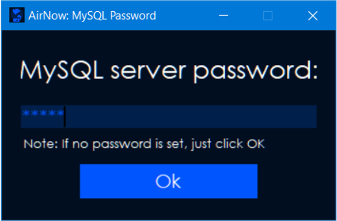
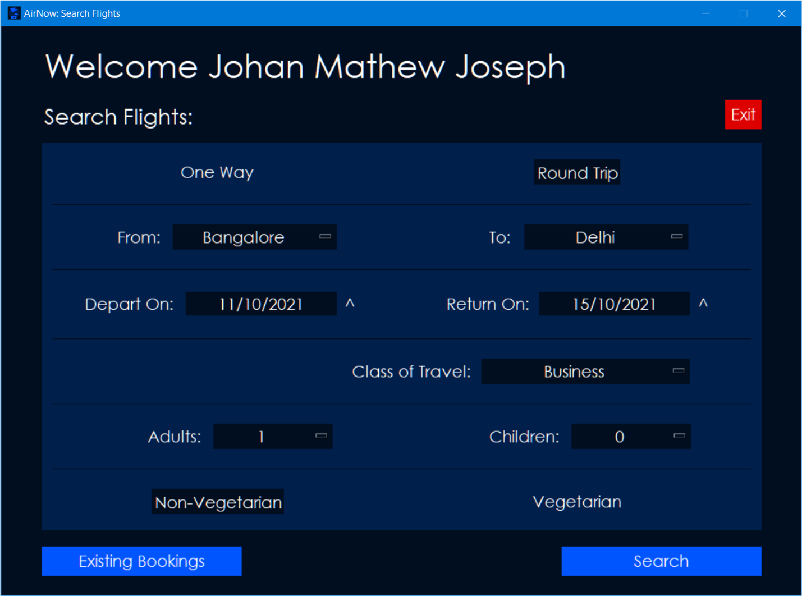
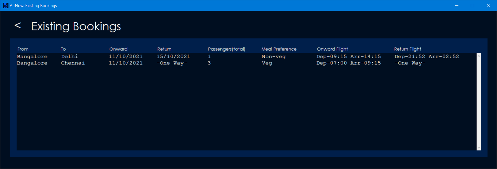

# AirNow
Airline Reservation System made using Python Tkinter

## Features
- Simple and Modern UI
- MySQL integration

    

- User accounts and authentication

    

    

- Search for flights based on various criteria

    

    

- Check existing bookings

    

## How to use
1. Install [Python3 (3.8.2 Recommended)](https://www.python.org/downloads/release/python-382/)
    - *IMPORTANT: tick the option that says "Add Python3 to PATH" during setup*
1. Install [MySQL](https://dev.mysql.com/downloads/installer/) (lesser file size)
    - *IMPORTANT: Do not forget MySQL root password*
2. Clone / Download .zip file of repository
3. Execute **app.py** through
    - Command Prompt:
        1. Navigate **AirNow** > **src** > **app.py**
        2. Use `python app.py` or `python3 app.py`
    - IDLE :
        1. Navigate **AirNow** > **src** > **app.py**
        2. Run > Run Module (in menu bar)
    - VS Code :
        1. Open **AirNow** in a VSCode workspace
        2. Install [Python extension](https://marketplace.visualstudio.com/items?itemName=ms-python.python) for VSCode
        2. Navigate **src** > **app.py**
        4. Select interpreter and click on the run icon

NOTE: An error can be displayed under the following circumstances:
1. Internet connection missing/unstable
2. Pip absent in Python PATH (Python not included to PATH)

***IMPORTANT: ONLY COMPATIBLE WITH WINDOWS 7 and above***

*MacOS and Linux are not supported due to Tkinter limitations*