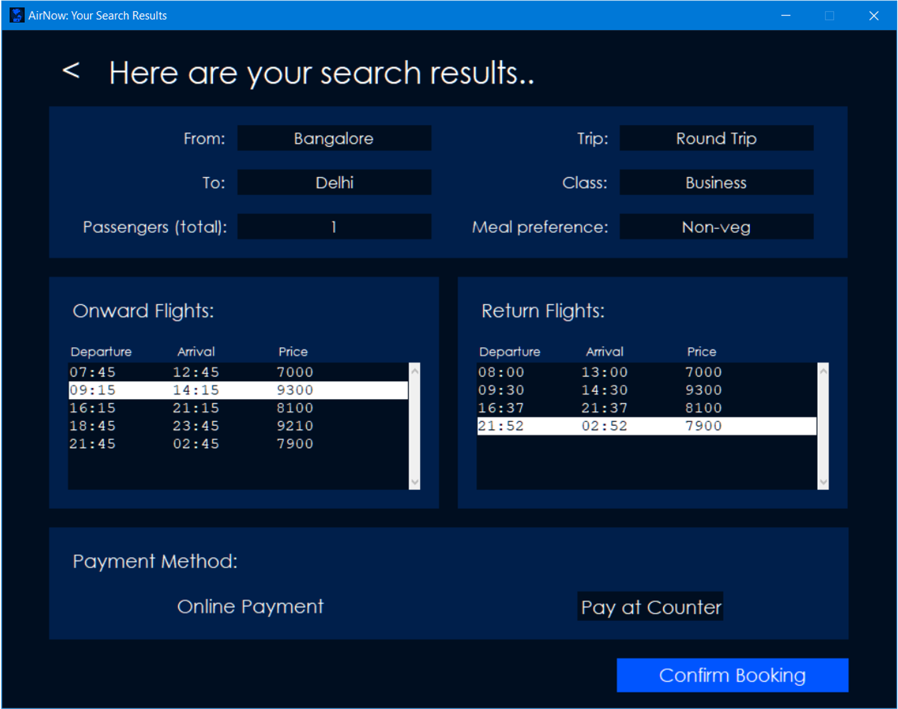

# AirNow
Airline Reservation System made using Python Tkinter

## Features
- Simple and Modern UI
- MySQL integration

- User accounts and authentication

- Search for flights based on various criteria

- Check existing bookings
